### How to Build and Run the Project
Prerequisites

Runtime: Python 3.10+ (or adjust if your project uses another runtime)

Package manager: pip / poetry / pipenv (pick one and be consistent)

### Local Setup
git clone <repo-url>
cd <repo-name>

python -m venv .venv
source .venv/bin/activate  # Windows: .venv\Scripts\activate

pip install -r requirements.txt

### Run the Application
python -m app

### Run Tests
pytest

### Key Design Principles for Production Engineering
- **Security-first:** Zero Trust, least privilege, and auditability.
- **Observable by default:** Metrics, logs, and traces emitted at every layer.
- **Traceable end-to-end:** Correlation IDs and data lineage across services.
- **Evolvable:** Versioned contracts and backward compatibility.
- **Reliable:** Bulkheads, retries, circuit breakers, and graceful degradation.
- **Resilient:** Designed to withstand failures and recover quickly.
- **Performant & Scalable:** Efficient resource use, caching, async processing, and horizontal scaling.
- **Cost-aware:** Optimize for operational and infrastructure efficiency.
- **Consumer-centric:** APIs designed for internal and external developer experience.
- **Governed:** Standards, policies, lifecycle management, and change control.
- **Sustainable:** Long-term maintainability, CI/CD, and platform ownership

# Key Design Layers for Production Engineering

### Diagram

```mermaid
flowchart TD
    %% API Consumers
    A["API Consumers"] --> B["API Gateway / Management"]
    
    %% API Gateway / Management Layer
    subgraph Gateway["API Gateway / Management"]
        B1["Authentication and Authorization"]
        B2["Rate Limiting / Throttling / Quotas"]
        B3["Request Validation and Transformation"]
        B4["Routing and Load Balancing"]
        B5["Caching"]
        B6["Policy Enforcement"]
        B7["API Analytics"]
    end
    B --> B1
    B --> B2
    B --> B3
    B --> B4
    B --> B5
    B --> B6
    B --> B7

    %% Application / Service Layer
    B --> C["Application / Service Layer"]
    subgraph AppService["Application / Service Layer"]
        C1["Microservices / Domain Services"]
        C2["Business Logic"]
        C3["Idempotency and Retries"]
        C4["Circuit Breakers and Bulkheads"]
        C5["Input / Output Contracts"]
    end
    C --> C1
    C --> C2
    C --> C3
    C --> C4
    C --> C5

    %% Event / Async Layer
    C --> D["Event / Async Layer"]
    subgraph EventAsync["Event / Async Layer"]
        D1["Message Queues"]
        D2["Event Streams"]
    end
    D --> D1
    D --> D2

    %% Integration Layer
    C --> E["Integration Layer"]
    subgraph Integration["Integration Layer"]
        E1["Legacy Systems"]
        E2["External APIs"]
        E3["Webhooks"]
        E4["Batch Interfaces"]
    end
    E --> E1
    E --> E2
    E --> E3
    E --> E4

    %% Data Layer
    D --> F["Data Layer"]
    E --> F
    subgraph Data["Data Layer"]
        F1["Operational Databases"]
        F2["Data Warehouse / Lake"]
        F3["Caches"]
        F4["Data Lineage and Metadata"]
    end
    F --> F1
    F --> F2
    F --> F3
    F --> F4

    %% Security & Identity
    subgraph Security["Security and Identity"]
        S1["Zero Trust / Least Privilege / Auditability"]
    end
    B --> S1
    C --> S1
    D --> S1
    E --> S1
    F --> S1

    %% Governance & Policy
    subgraph Governance["Governance and Policy"]
        G1["Standards, Versioning, Lifecycle Management, Compliance"]
    end
    B --> G1
    C --> G1
    E --> G1
    F --> G1

    %% Performance & Scalability
    subgraph Performance["Performance and Scalability"]
        P1["Caching, Async Processing, Horizontal Scaling, Payload Optimization"]
    end
    B --> P1
    C --> P1
    D --> P1
    E --> P1
    F --> P1

    %% Developer Experience (DX)
    subgraph DX["Developer Experience"]
        DX1["Docs, SDKs, Portals, Sandbox, Examples"]
    end
    B --> DX1
    C --> DX1

    %% Data & Contract Integrity
    subgraph DataIntegrity["Data and Contract Integrity"]
        DI1["Schema Validation, Strong Contracts, Data Quality Checks"]
    end
    C --> DI1
    D --> DI1
    F --> DI1

    %% Platform & Operating Model
    subgraph Platform["Platform and Operating Model"]
        PL1["Ownership, CI/CD, IaC, Cost Allocation, API Product Management"]
    end
    B --> PL1
    C --> PL1
    D --> PL1
    E --> PL1
    F --> PL1

    %% Cross-Cutting Concerns
    subgraph CrossCutting["Cross-Cutting Concerns"]
        CC1["Observability: Metrics, Logs, Traces, Alerts, SLOs"]
        CC2["Traceability: Correlation IDs, Distributed Tracing, Audit Logs"]
    end
    B --> CC1
    C --> CC1
    D --> CC1
    E --> CC1
    F --> CC1
    B --> CC2
    C --> CC2
    D --> CC2
    E --> CC2
    F --> CC2
```

### Key Design Layer Capabilities for Production Engineering

## 1. Security & Identity
**Purpose:** Protect data and control access.

**Key Capabilities:**
- Authentication (OAuth2, OIDC, JWT, mTLS)
- Authorization (RBAC, ABAC, scopes)
- API keys, secrets management
- Encryption (TLS in transit, at rest)
- Input validation & threat protection
- Compliance with OWASP API Top 10

**Enterprise concern:** Zero Trust, least privilege, regulatory compliance (HIPAA, SOC 2).

---

## 2. Governance, Policy & Lifecycle
**Purpose:** Ensure consistency, prevent sprawl, and evolve APIs safely.

**Key Capabilities:**
- API standards (naming, versioning, error formats)
- Contract-first design (OpenAPI / Swagger)
- Lifecycle management (design → deploy → retire)
- Versioning, deprecation policies, sunset timelines
- Policy enforcement (rate limits, quotas, IP allowlists)
- Change management & approval workflows

**Enterprise concern:** Prevent API sprawl, breaking changes, and support slow consumer migration cycles.

---

## 3. API Gateway & Traffic Management
**Purpose:** Central control plane to protect systems and enforce policies.

**Key Capabilities:**
- Authentication & authorization enforcement
- Traffic shaping: rate limits, quotas, throttling
- Policy enforcement (security, routing, compliance)
- Load balancing, request shaping
- Analytics & reporting

**Enterprise concern:** One bad consumer should never degrade platform reliability.  
**Enterprise concern:** Controlling costs at scale through efficient resource use.

---

## 4. Reliability & Resilience
**Purpose:** Keep APIs available under failure.

**Key Capabilities:**
- High availability & failover
- Graceful degradation
- Bulkheads & backpressure handling
- Idempotency & safe retries
- Circuit breakers, timeouts, disaster recovery

**Enterprise concern:** Ensuring business continuity under failures or disruptions.

---

## 5. Observability & Traceability
**Purpose:** Understand system health, behavior, and ensure compliance.

**Key Capabilities:**
- Metrics, logs, distributed tracing
- SLIs / SLOs / SLAs for measurable reliability
- Correlation IDs & audit logs
- Data lineage and forensic analysis

**Enterprise concern:** Fast detection and resolution of incidents.  
**Enterprise concern:** Ensuring compliance, enabling root cause analysis, and legal defensibility.

---

## 6. Performance & Scalability
**Purpose:** Handle growth efficiently without compromising cost.

**Key Capabilities:**
- Caching (edge, gateway, application)
- Async processing (events, queues)
- Pagination & filtering, payload optimization
- Horizontal scaling

**Enterprise concern:** Cost-efficient scalability and optimized resource utilization.

---

## 7. Data & Contract Integrity
**Purpose:** Ensure correctness, trust, and reliability of data.

**Key Capabilities:**
- Schema validation & strong contracts
- Backward-compatible changes
- Error standardization
- Data quality checks

**Enterprise concern:** Preventing bad data from propagating and breaking downstream systems.

---

## 8. Compliance & Risk Management
**Purpose:** Meet legal, regulatory, and audit requirements.

**Key Capabilities:**
- HIPAA / GDPR / SOC 2 controls
- Data masking & tokenization
- Consent management
- Retention, deletion, and audit evidence collection

**Enterprise concern:** Minimizing regulatory exposure while maintaining traceability and auditability.

---

## 9. Integration & Interoperability
**Purpose:** Fit into heterogeneous systems and evolving ecosystems.

**Key Capabilities:**
- Event-driven APIs & webhooks
- Batch interfaces and legacy adapters
- Standards compliance (FHIR, HL7, ISO, etc.)

**Enterprise concern:** APIs operate within a complex ecosystem and must dynamically adapt to consumers, traffic, and dependencies.

---

## 10. Developer Experience (DX)
**Purpose:** Drive adoption and reduce support burden.

**Key Capabilities:**
- Clear documentation, OpenAPI specs
- SDKs & client libraries
- Developer portal & sandbox environments
- Example payloads and error messages

**Enterprise concern:** Enable internal teams to move faster with minimal friction.

---

## 11. Platform & Operating Model
**Purpose:** Make APIs sustainable at scale.

**Key Capabilities:**
- Platform ownership & shared services
- CI/CD pipelines and Infrastructure as Code
- Cost allocation / chargeback
- API product management

**Enterprise concern:** Long-term sustainability through maintainable design, operational efficiency, and controlled evolution.

